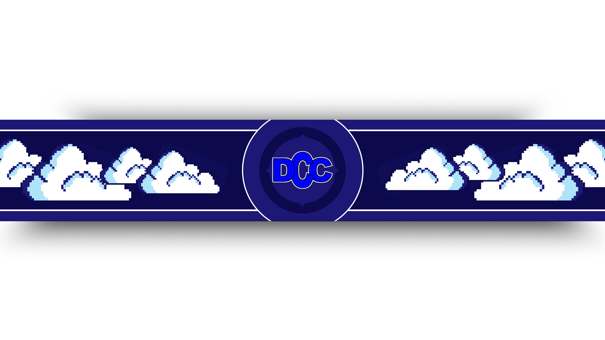

<!-- Banner -->

  

<h1 align="center">
  <strong>DIPANEGARA COMPUTER CLUB</strong>
</h1>

---

## 🧑‍💻 Profil Peserta Hackathon

Halo! Saya adalah Team yang mengikuti Hackathon ini dengan penuh antusias.  
README ini menjadi dokumentasi perjalanan, ide, hingga proses pembangunan project yang saya kerjakan selama kompetisi berlangsung.  

Hackathon bagi saya bukan hanya event, tapi ajang untuk:
- Belajar cepat,
- Mencoba hal baru,
- Menggabungkan kreativitas + teknologi,
- Dan tentunya *mendorong diri melewati batas nyaman*.

---

## 💡 Ide & Gambaran Project

Project ini dibuat sebagai solusi dari problem statement yang diberikan, dengan fokus pada:

- 🔍 **Analisis cepat dan tepat terhadap permasalahan**
- 🧩 **Pendekatan kreatif & mudah dipahami**
- ⚙️ **Implementasi logika sederhana namun efektif**
- 🎯 **Output yang memberikan value nyata**

---

## 🚧 Proses & Tahapan Pengembangan

1. **Brainstorming** — Menemukan masalah yang relevan.  
2. **Research** — Mengumpulkan referensi, requirement, dan kemungkinan solusi.  
3. **Prototype** — Membuat struktur awal dan flow utama.  
4. **Build** — Mengimplementasikan fitur inti.  
5. **Testing** — Mencoba berbagai skenario untuk memastikan stabilitas.  
6. **Improve** — Menambah polish di bagian UI/UX atau performa.  

---

## 🔥 Tagline Pribadi Saya di Hackathon Ini

> ### **“Ingin Hackathon Namun Enggan Ngoding”**
> Ironis? Mungkin.  
> Tapi di sinilah seni hackathon — *berpikir cepat, membangun seperlunya, dan mengeksekusi ide sebaik mungkin.*

---

## 📂 Struktur Proyek

